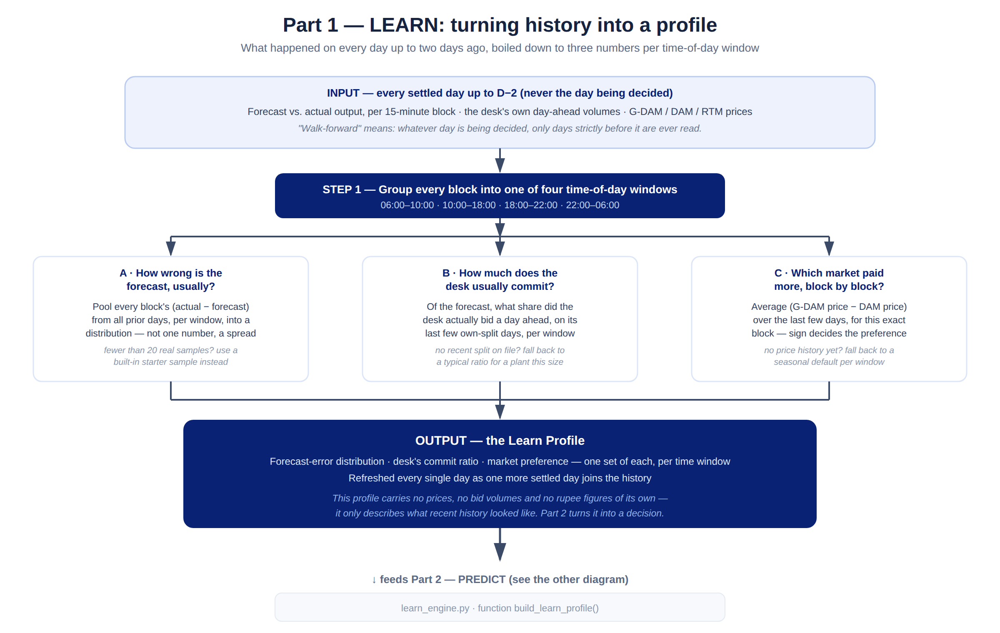
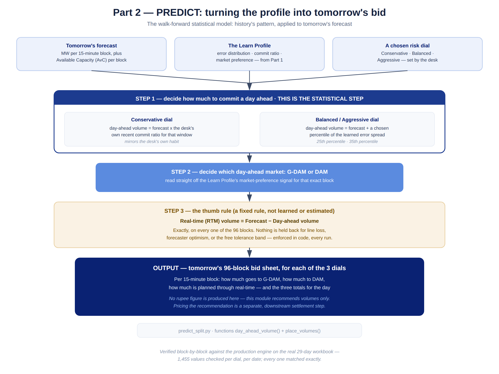

# Learn and Predict, explained simply

*What the two pieces of the Market Desk's decision logic actually do — no jargon, no code — plus the deployable Python for each. Written 19 September 2026.*

## The two-sentence version

Every day, the desk has to decide how much of tomorrow's expected wind output to sell a day ahead (locking in a price now) versus how much to leave for real-time trading (finding out the price tomorrow, as generation actually happens). **Learn** looks backward — it studies the days that have already happened and works out how the plant and the market have actually been behaving lately. **Predict** looks forward — it takes that understanding and tomorrow's forecast, and turns them into an actual recommended bid: how many megawatts, in which market, for each of the 96 fifteen-minute slots in the day.

Neither part touches money. Learn produces a statistical picture of recent behaviour; Predict produces a volume plan. Pricing that plan — working out what it would actually earn — is a separate step that both parts feed into but neither one performs.

---

## Part 1 — LEARN



### What goes in

Every day that has already fully settled, up to two days before the day being decided (never anything more recent — more on why below). For each of those days, three things:

- what the forecast said the plant would generate, and what it actually generated, for every 15-minute slot
- how much the desk itself chose to sell a day ahead, on the days it made that choice
- what price each market (G-DAM, DAM, real-time) actually cleared at, slot by slot

### What it does

It does not try to remember every individual 15-minute slot separately — six days of history is only six data points for slot number 42 alone, which is not enough to say anything reliable. Instead it groups the day into four broad windows — early morning (06:00–10:00), the midday stretch (10:00–18:00), the evening peak (18:00–22:00), and overnight (22:00–06:00) — and pools every day's data within each window. That turns "six days" into "six days times sixteen or so slots per window," which is enough to say something meaningful.

For each of those four windows, it works out three things:

1. **How wrong the forecast usually is.** Not a single number — a whole spread, because some days the forecast is close and some days it's badly off, and the shape of that spread matters more than its average.
2. **How much the desk itself usually commits a day ahead**, as a share of what the forecast said, based on the days it made that choice recently.
3. **Which day-ahead market has been paying more** — G-DAM or DAM — read off the average price difference between them over the last few days, for that specific 15-minute slot.

If there isn't enough real history yet for a window (fewer than 20 real observations), it doesn't guess wildly — it falls back to a starter pattern taken from a comparable wind plant, and clearly marks that it did so. As soon as enough real days accumulate, the real pattern takes over automatically.

**Why "walk-forward" matters.** The rule that only days up to two days before the decision are ever used is not a technicality — it's what keeps the whole system honest. If Learn were ever allowed to peek at the day it's about to help decide, or even at yesterday (which hasn't fully settled yet), every result would be quietly cheating, the way a stock-picking strategy looks brilliant if it's allowed to know tomorrow's prices. Walk-forward means Learn only ever knows what a person sitting at the desk that morning would actually have known.

### What comes out

A profile — call it the "learn profile" — with three parts (error spread, commit ratio, market preference), one set for each of the four time-of-day windows, refreshed fresh every single day as one more day's outcome becomes available to learn from. It contains no prices, no bid numbers, no money — just a description of what recent behaviour has looked like.

---

## Part 2 — PREDICT (the walk-forward statistical model)



### What goes in

Three things: tomorrow's forecast (megawatts per 15-minute slot, plus the plant's available capacity for each slot), the learn profile Part 1 just built, and a choice of risk posture — the desk picks one of three named "dials":

- **Conservative** — stay close to what the desk itself usually does
- **Balanced** — commit a bit less day-ahead than usual, leaning on the learned forecast-error pattern
- **Aggressive** — commit a bit more day-ahead than Balanced, same underlying method

### What it does

**Step 1 is the actual statistics.** It decides how many of tomorrow's expected megawatts to commit a day ahead, per slot. On the Conservative dial, that's simple: take the forecast and multiply by the desk's own recent commit ratio for that time window — in effect, "behave the way the desk usually behaves." On Balanced and Aggressive, it does something more deliberate: instead of committing the forecast number itself, it commits the forecast *plus a chosen percentile of the learned error spread* — for example, the level that history's forecast error has beaten one time in four. This is a standard technique for exactly this kind of problem: because coming up short and having a surplus are not penalised the same way, the safest number to commit to is not "the average expected outcome," it's a deliberately chosen point in the distribution of what's actually happened before. That chosen point is what "Balanced" and "Aggressive" differ on.

**Step 2** decides which day-ahead market — G-DAM or DAM — each slot's committed volume should go through, read straight off the market-preference signal Part 1 already worked out for that slot.

**Step 3 is not statistics at all — it's a fixed rule, applied without exception.** Whatever wasn't committed day-ahead in Step 1 is planned through real-time, and the two must always add back to exactly the original forecast, slot by slot, with nothing quietly held back or lost along the way. This "thumb rule" is enforced in the code itself, not left to judgement, precisely so it can never silently drift.

### What comes out

A complete 96-slot bid sheet for tomorrow: for every 15-minute slot, how many megawatts go to G-DAM, how many to DAM, and how many are planned through real-time — produced separately for all three dials, so the desk can see all three side by side before choosing one.

---

## Why this is two separate pieces, not one

Learn never sees tomorrow — it only ever looks backward. Predict never looks backward on its own — it only ever combines what Learn already found with tomorrow's forecast. Keeping them apart means each one can be checked on its own terms: Learn can be judged purely on "did it describe recent history accurately," and Predict can be judged purely on "given that description, did it produce a sensible plan." If they were tangled together, a wrong number could hide in either half and be much harder to trace back.

---

## The deployable Python

Two files, delivered alongside this document:

- **`learn_engine.py`** — Part 1, above. Its single entry point is `build_learn_profile(all_days, target_day)`.
- **`predict_split.py`** — Part 2, above. Its single entry point is `predict_all_dials(day, profile)`, which returns the bid sheet for all three dials at once.

```python
from learn_engine import build_learn_profile
from predict_split import predict_all_dials

# all_days: a dict of {date-string: Day} for every day on file, already parsed
#           from the workbook (Day is a plain data container defined in learn_engine.py)
# tomorrow: a Day for the date being decided, with act=None (nothing settled yet)

profile = build_learn_profile(all_days, tomorrow, k=3)
bids = predict_all_dials(tomorrow, profile)

for dial_name, sheet in bids.items():
    print(dial_name, "day-ahead MWh:", sheet.gdam_dam_mwh, "  RTM MWh:", sheet.rtm_mwh)
```

Both files are self-contained (only `numpy` as a dependency, for the one statistical function that needs a percentile), have no network calls, and hold no customer-identifying information — they operate on plain numbers, so they can be dropped into a scheduled job, an Azure Function, or run by hand from a terminal without any change.

### Verified, not just translated

This is not a rewrite from memory — it is a line-by-line port of the same logic already running in the production engine (`engine/compare_app.js`, the code already verified against the desk's own settlement to the rupee). Before delivery, both files were checked against that production engine's own output, on the real reference workbook, for two different dates and all three dials — **1,455 individual values per dial, per date, covering every one of the 96 blocks** (the day-ahead commitment, the G-DAM/DAM/RTM split, and the thumb-rule identity on every block). Every single one matched exactly. The verification script (`verify_learn_predict.py`) was delivered with the original hand-off; it needs the JS engine's reference outputs, which are not part of this repository.

---

## A few honest caveats

The forecast-error percentile used for Balanced (25th) and Aggressive (35th) are fixed settings carried over from the existing system, not something this document is proposing to change. The "which market pays more" signal looks three days back by default — a deliberately short memory, on purpose, because market conditions shift and a rule that's too confident about "the way things always are" is worse than one that adapts quickly. And the built-in starter sample used when history is thin was learned from six days on one comparable 102 MW wind site — it is a reasonable starting point, not a promise that this specific plant behaves identically.
